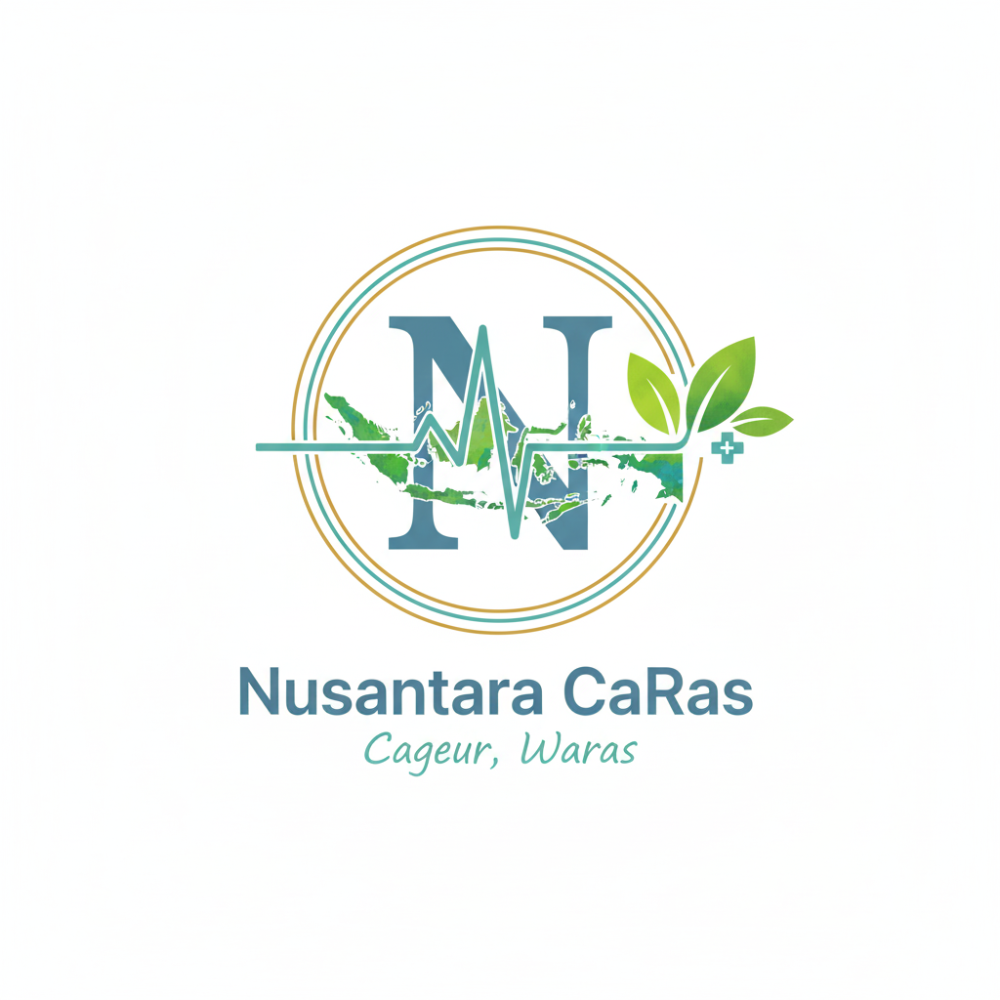

# 🌏 Nusantara CaRas — Multilingual Medical Chatbot




**Nusantara CaRas** (Cultural & Regional Aware Symptom Assistant) is an AI-powered medical chatbot designed for communities in Indonesia.
It acts as a **virtual doctor assistant**, capable of understanding and responding in **Bahasa Indonesia, Sundanese, and Javanese**.

---

## 🚀 Features

- 🤖 **Medical Assistant**: Acts like a doctor, guiding patients with structured symptom intake.
- 🏥 **Doctor Reports**: Automatically generates structured diagnostic reports for follow-up.
- 🌐 **Multilingual**: Switch seamlessly between **Indonesian, Sundanese, and Javanese**.
- 🔗 **Real-time Chat**: WebSocket-based, with typing indicators and streaming responses.
- 📑 **Session Management**: Chats stored in PostgreSQL with retrieval of history.
- 🛡 **Authentication**: JWT + session token validation with expiry and revocation.
- 🎨 **Modern UI**: React + Tailwind with sidebar for conversation management.

---

## 🏗 Tech Stack

- **Backend**: [FastAPI](https://fastapi.tiangolo.com/) + PostgreSQL + Qdrant
- **Frontend**: React (Vite) + TailwindCSS
- **Authentication**: JWT + session token store
- **Real-time**: WebSocket (FastAPI + custom manager)
- **AI Models**:
  - [SEA-LION](https://huggingface.co/aisingapore/Gemma-SEA-LION-v4-27B-IT) — multilingual local language understanding
  - [MedGEMMA] (https://huggingface.co/google/medgemma-27b-it) — medical domain reasoning
  - Custom reranker + parser agents

---

## 📦 Installation

### 1. Clone the Repo
```bash
git clone git@github.com:your-username/nusantara-caras.git
cd nusantara-caras
```

### 2. Backend setup

```bash
cd source/backend
python -m venv .venv
source .venv/bin/activate
pip install -r requirements.txt
```

### 3. Frontend Setup

```bash
cd source/front-end
npm install
npm run dev -- --host 0.0.0.0
```

Build for production:

```bash
npm run build
npm run preview -- --host 0.0.0.0
```